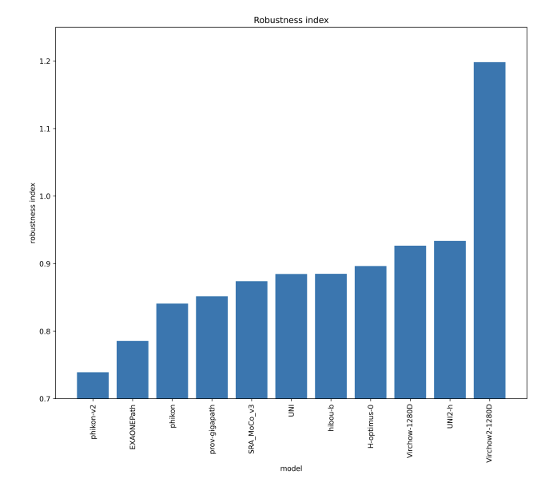

<!-- //#<!h1 class="about-heading">Edwin D. de Jong</h1> -->
<h3>Principal Medical AI Researcher | Pathology Foundation Model Robustness | FDA Approved Radiology AI</h3> 

I am a researcher who builds medical AI technology that improves healthcare.

Below I summarize my recent experience. See my selected [papers](#papers), or visit my [Google Scholar profile](https://scholar.google.com/citations?view_op=list_works&hl=en&hl=en&user=l9w80gcAAAAJ&pagesize=80&sortby=pubdate) for a full list. Feel free to reach out with questions or if you'd like to discuss some of this work.

 contact:
[jong.de.edwin.work@gmail.com](mailto:jong.de.edwin.work@gmail.com), or contact me on linkedin [here](https://www.linkedin.com/in/edwin-d-de-jong-260930/)

<h1 style="margin-top: 3em; margin-bottom: 1.0em;">Experience</h1>

  
  

    

      

        Principal Machine Learning Scientist
        Dec 2024 - present
      

      Soon after I started at <a href="https://www.aignostics.com/">Aignostics</a>, we trained the first <a href="https://arxiv.org/abs/2501.05409">📄 Atlas</a> foundation model.
Building further on my independent research into robustness, I collaborated with the <a href="https://www.bifold.berlin/">BIFOLD</a> team at TU Berlin to develop <a href="https://github.com/bifold-pathomics/PathoROB">PathoROB</a>, a benchmark for evaluating robustness in pathology foundation models:  
        <a href="https://arxiv.org/abs/2507.17845">📄 Towards Robust Foundation Models for Digital Pathology</a>  

Invited talk on this work in the <a href="https://warwick.ac.uk/fac/cross_fac/tia/seminars/">TIA seminar series</a>:

      <iframe width="560" height="315" src="https://www.youtube.com/embed/UDkoVZ95nQM?si=CodNTXJNGQUZj_YI" title="YouTube video player" frameborder="0" allow="accelerometer; autoplay; clipboard-write; encrypted-media; gyroscope; picture-in-picture; web-share" referrerpolicy="strict-origin-when-cross-origin" allowfullscreen></iframe> 

After this, <a href="https://arxiv.org/abs/2601.05148">📄 Atlas 2</a> was trained. As the article shows, Atlas 2 currently leads the Pareto front in performance-robustness trade-offs.

    

  

  
  

    

      

        Independent Researcher
        Nov 2024
      

      Intrigued by the strong representation of medical centers in embedding spaces, I undertook independent research examining foundation model robustness. As part of this work, I introduced the Robustness Index metric to quantify model stability across medical domains. Article: 
        <a href="https://arxiv.org/abs/2501.18055">📄 Current Pathology Foundation Models are unrobust to Medical Center Differences</a>
      
    

  

  
  

    

      

        Researcher
        May 2022 - Nov 2024
      

      At <a href="https://kaiko.ai/">Kaiko.ai</a>, we trained  <a href="https://arxiv.org/abs/2404.15217">📄 pathology foundation models</a>. While analyzing the resulting models, I observed that the embedding space strongly encodes medical centers. This sparked my subsequent research into foundation model robustness. 
      See also our poster at the <a href="https://www.genomicsengland.co.uk/events/genomics-england-research-summit-2024">Genomics England Research Summit 2024</a> on <a href="https://edwin-de-jong.github.io/pub/Pathology-RNA-poster-London-Genomics.pdf">📄 Enhancing pathology foundation models with transcriptomics</a>.

    

  

  
  

    

      

        Principal Machine Learning Scientist
        Sept 2018 - Apr 2022
      

      At <a href="https://screenpoint-medical.com/">ScreenPoint</a> I contributed to Transpara, a radiology AI breast cancer detection product. With the team, we were able to improve breast cancer detection performance beyond the level of human radiologists.  
      The <a href="https://www.thelancet.com/journals/lanonc/article/PIIS1470-2045(23)00298-X/abstract">MASAI</a> Randomized Controlled Trial (RCT) showed that Transpara reduces radiologist workload by 44% while at the same time <a href="https://www.thelancet.com/journals/landig/article/PIIS2589-7500(24)00267-X/fulltext">increasing the cancer detection rate by 29%</a>.
    

  

  
  

    

      

        Mentor, coaching A.I. startups
        Sep 2017 - Jul 2021
      

As a mentor in several editions of RockStart's AI Accelerator programme, I evaluated many AI startups and coached and advised a selection of AI startups including <a href="https://mtsprout.nl/ranglijst/25-onder-de-25-van-2018/birdsai">Birds.AI</a>, <a href="https://www.medvice.io/en">Medvice</a>, <a href="https://skinive.com/">Skinive</a>, and <a href="https://www.plantik.bio/">Plantik</a>.
    

  

<h1>Blog Posts</h1>

Occasional writings and tutorials on machine learning.

  

  

    <h3 style="margin-top: 0em;">
      <a href="/viz/mlp/" target="_blank" rel="noopener noreferrer">
        blog titel
      </a>
    </h3>

    

      uitleg
    

  

<!-- Blog 1 -->

  

  

    <h3 style="margin-top: 0em; margin-bottom: 1em;">
      blog titel
    </h3>

    

      auteurs
    

    

      samenvatting
    

  

<!-- Custom styled HR -->

<h1>Selected Papers</h1>

    

      For a full list of research papers, see my
      <a href="https://scholar.google.com/citations?view_op=list_works&hl=en&hl=en&user=l9w80gcAAAAJ&pagesize=80&sortby=pubdate" target="_blank">
        Google Scholar page</a>. 
      * Asterisks denote shared first authorship.
    

<!-- year -->

  

    <h2 style="margin:0;">2025</h2>
  

<!-- Paper -->

  <!-- Square thumbnail -->
  
  <!-- Text content -->
  

    <h3 style="margin:0 0 0.3em 0;">
      <a href="https://arxiv.org/abs/2507.17845">     
Towards Robust Foundation Models for Digital Pathology
      </a>
    </h3>
    

      arXiv preprint
    

    

      <small>Jonah Kömen*, <strong>Edwin D. de Jong*</strong>, Julius Hense*, Hannah Marienwald, Jonas Dippel, Philip Naumann, Eric Marcus, Lukas Ruff, Maximilian Alber, Jonas Teuwen, Frederick Klauschen, Klaus-Robert Müller</small>
    

    

    We evaluate the robustness of 20 current pathology foundation models against medical center differences caused by variations in surgical and endoscopic techniques, laboratory procedures, and scanner technology. We introduce metrics to quantify robustness and find that lack of robustness can lead to diagnostic errors in downstream prediction models.  

We introduce the <a href="https://github.com/bifold-pathomics/PathoROB">PathoROB</a> benchmark for evaluation of foundation model robustness, covering four datasets and 28 biological classes from 34 medical centers. 
    

    

      
abstract

      

Biomedical Foundation Models (FMs) are rapidly transforming AI-enabled healthcare research and entering clinical validation. However, their susceptibility to learning non-biological technical features -- including variations in surgical/endoscopic techniques, laboratory procedures, and scanner hardware -- poses risks for clinical deployment. We present the first systematic investigation of pathology FM robustness to non-biological features. Our work (i) introduces measures to quantify FM robustness, (ii) demonstrates the consequences of limited robustness, and (iii) proposes a framework for FM robustification to mitigate these issues. Specifically, we developed PathoROB, a robustness benchmark with three novel metrics, including the robustness index, and four datasets covering 28 biological classes from 34 medical centers. Our experiments reveal robustness deficits across all 20 evaluated FMs, and substantial robustness differences between them. We found that non-robust FM representations can cause major diagnostic downstream errors and clinical blunders that prevent safe clinical adoption. Using more robust FMs and post-hoc robustification considerably reduced (but did not yet eliminate) the risk of such errors. This work establishes that robustness evaluation is essential for validating pathology FMs before clinical adoption and demonstrates that future FM development must integrate robustness as a core design principle. PathoROB provides a blueprint for assessing robustness across biomedical domains, guiding FM improvement efforts towards more robust, representative, and clinically deployable AI systems that prioritize biological information over technical artifacts.
      

    

  

<!-- Paper -->

  <!-- Square thumbnail -->
  
  <!-- Text content -->
  

    <h3 style="margin:0 0 0.3em 0;">
      <a href="https://www.arxiv.org/art">
      Atlas: A Novel Pathology Foundation Model by Mayo Clinic, Charité, and Aignostics
      </a>
    </h3>
    

      arXiv preprint
    

    

<small>Maximilian Alber, Stephan Tietz, Jonas Dippel, Timo Milbich, Timothée Lesort, Panos Korfiatis, Moritz Krügener, Beatriz Perez Cancer, Neelay Shah, Alexander Möllers, Philipp Seegerer, Alexandra Carpen-Amarie, Kai Standvoss, Gabriel Dernbach, <strong>Edwin de Jong</strong>, Simon Schallenberg, Andreas Kunft, Helmut Hoffer von Ankershoffen, Gavin Schaeferle, Patrick Duffy, Matt Redlon, Philipp Jurmeister, David Horst, Lukas Ruff, Klaus-Robert Müller, Frederick Klauschen, Andrew Norgan</small>
    

    

    This article introduces the first Atlas foundation model.
    

    

      
abstract

      

      Recent advances in digital pathology have demonstrated the effectiveness of foundation models across diverse applications. In this report, we present Atlas, a novel vision foundation model based on the RudolfV approach. Our model was trained on a dataset comprising 1.2 million histopathology whole slide images, collected from two medical institutions: Mayo Clinic and Charité - Universtätsmedizin Berlin. Comprehensive evaluations show that Atlas achieves state-of-the-art performance across twenty-one public benchmark datasets, even though it is neither the largest model by parameter count nor by training dataset size.
      

    

  

<!-- Paper -->

  <!-- Square thumbnail -->
  
  <!-- Text content -->
  

    <h3 style="margin:0 0 0.3em 0;">
      <a href="https://arxiv.org/abs/2501.18055">
      Current pathology foundation models are unrobust to medical center differences
      </a>
    </h3>
    

      arXiv preprint
    

    

      <strong>Edwin D. de Jong</strong>, Eric Marcus, Jonas Teuwen
    

    

      We measure whether pathology foundation models focus on biological features like tissue and cancer type, or on the confounding medical center signatures introduced by staining procedure and other differences. We introduce the <em>Robustness Index</em>: a novel metric reflecting to what degree biological features dominate confounding features.  

Ten current publicly available pathology FMs are evaluated. We find that all current pathology foundation models evaluated represent the medical center to a strong degree.     
    

    

      

    

    

      
abstract

      

      Pathology Foundation Models (FMs) hold great promise for healthcare. Before they can be used in clinical practice, it is essential to ensure they are robust to variations between medical centers. We measure whether pathology FMs focus on biological features like tissue and cancer type, or on the well known confounding medical center signatures introduced by staining procedure and other differences. We introduce the Robustness Index. This novel robustness metric reflects to what degree biological features dominate confounding features. Ten current publicly available pathology FMs are evaluated. We find that all current pathology foundation models evaluated represent the medical center to a strong degree. Significant differences in the robustness index are observed. Only one model so far has a robustness index greater than one, meaning biological features dominate confounding features, but only slightly. A quantitative approach to measure the influence of medical center differences on FM-based prediction performance is described. We analyze the impact of unrobustness on classification performance of downstream models, and find that cancer-type classification errors are not random, but specifically attributable to same-center confounders: images of other classes from the same medical center. We visualize FM embedding spaces, and find these are more strongly organized by medical centers than by biological factors. As a consequence, the medical center of origin is predicted more accurately than the tissue source and cancer type. The robustness index introduced here is provided with the aim of advancing progress towards clinical adoption of robust and reliable pathology FMs.
      

    

  

<!-- Paper -->

  <!-- Square thumbnail -->
  
  <!-- Text content -->
  

    <h3 style="margin:0 0 0.3em 0;">
      <a href="https://arxiv.org/abs/2404.15217">
      Towards Large-Scale Training of Pathology Foundation Models
      </a>
    </h3>
    

      arXiv preprint
    

    

      <small>kaiko.ai, Nanne Aben, <strong>Edwin D. de Jong</strong>, Ioannis Gatopoulos, Nicolas Känzig, Mikhail Karasikov, Axel Lagré, Roman Moser, Joost van Doorn, Fei Tang</small>
    

    

    We train a pathology foundation model on TCGA and describe our training pipeline. The <a href="https://github.com/kaiko-ai/eva">eva</a> open-source framework for pathology FM evaluation is presented.
    

    

      
abstract

      

      Driven by the recent advances in deep learning methods and, in particular, by the development of modern self-supervised learning algorithms, increased interest and efforts have been devoted to build foundation models (FMs) for medical images. In this work, we present our scalable training pipeline for large pathology imaging data, and a comprehensive analysis of various hyperparameter choices and training techniques for building pathology FMs. We release and make publicly available the first batch of our pathology FMs (this https URL) trained on open-access TCGA whole slide images, a commonly used collection of pathology images. The experimental evaluation shows that our models reach state-of-the-art performance on various patch-level downstream tasks, ranging from breast cancer subtyping to colorectal nuclear segmentation. Finally, to unify the evaluation approaches used in the field and to simplify future comparisons of different FMs, we present an open-source framework (this https URL) designed for the consistent evaluation of pathology FMs across various downstream tasks.
      

    

  

<!-- Paper -->

  <!-- Square thumbnail -->
  
  <!-- Text content -->
  

    <h3 style="margin:0 0 0.3em 0;">
      <a href="https://edwin-de-jong.github.io/pub/Pathology-RNA-poster-London-Genomics.pdf">
      Enhancing Pathology Foundation Models with Transcriptomics. 
      </a>
    </h3>
    

      Poster at the <a href="https://www.genomicsengland.co.uk/events/genomics-england-research-summit-2024">Genomics England Research Summit 2024</a>. 
    

    

      <small><strong>Edwin D. de Jong</strong>, Mikhail Karasikov, Marharyta Kurban, Moritz Platscher, Marie Stettler, Fei Tang</small>
    

    
    

      

    

Pathology Foundation Models (FMs) such as UNI, Phikon, RudolfV and Virchow learn to represent patterns in H&E pathology images using Self-Supervised Learning. To see whether pathology FMs can be enhanced using RNA data, we compared two approaches: finetuning a pretrained pathology FM by using RNA expression levels as a high-dimensional target vector vs. using contrastive learning in a CLIP setup . We found that both approaches can improve pathology FM performance, as evaluated on a selection of downstream tasks.
    

  

<!-- Paper -->

  <!-- Square thumbnail -->
  
  <!-- Text content -->
  

    <h3 style="margin:0 0 0.3em 0;">
      <a href="https://arxiv.org/abs/1611.03068">
      Incremental sequence learning
      </a>
    </h3>
    

     <a href="https://neurips.cc/virtual/2016/workshop/6240">NIPS (NeurIPS) 2016 Workshop on Continual Learning and Deep Networks</a>
    

    

      <strong>Edwin D. de Jong</strong>
    

    

    This paper studies a generative Mixture Density RNN model for sequence learning. It introduces Incremental Sequence Learning: an approach to sequence learning where the length of training sequences is gradually increased over the course of training. Incremental Sequence Learning is found to speed up sequence learning by a factor 20, to reduce the test error, and to perform more robustly.   

The paper introduces and makes available the MNIST pen stroke sequences dataset: a novel sequence learning task and data set that represents MNIST digits as sequences of pen movements that reproduce the digit.
    

    

      
abstract

      

      Deep learning research over the past years has shown that by increasing the scope or difficulty of the learning problem over time, increasingly complex learning problems can be addressed. We study incremental learning in the context of sequence learning, using generative RNNs in the form of multi-layer recurrent Mixture Density Networks. While the potential of incremental or curriculum learning to enhance learning is known, indiscriminate application of the principle does not necessarily lead to improvement, and it is essential therefore to know which forms of incremental or curriculum learning have a positive effect. This research contributes to that aim by comparing three instantiations of incremental or curriculum learning.  
      
We introduce Incremental Sequence Learning, a simple incremental approach to sequence learning. Incremental Sequence Learning starts out by using only the first few steps of each sequence as training data. Each time a performance criterion has been reached, the length of the parts of the sequences used for training is increased.  

We introduce and make available a novel sequence learning task and data set: predicting and classifying MNIST pen stroke sequences. We find that Incremental Sequence Learning greatly speeds up sequence learning and reaches the best test performance level of regular sequence learning 20 times faster, reduces the test error by 74%, and in general performs more robustly; it displays lower variance and achieves sustained progress after all three comparison methods have stopped improving. The other instantiations of curriculum learning do not result in any noticeable improvement. A trained sequence prediction model is also used in transfer learning to the task of sequence classification, where it is found that transfer learning realizes improved classification performance compared to methods that learn to classify from scratch.
      

    

  

